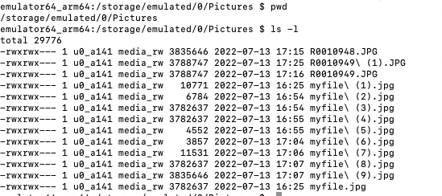
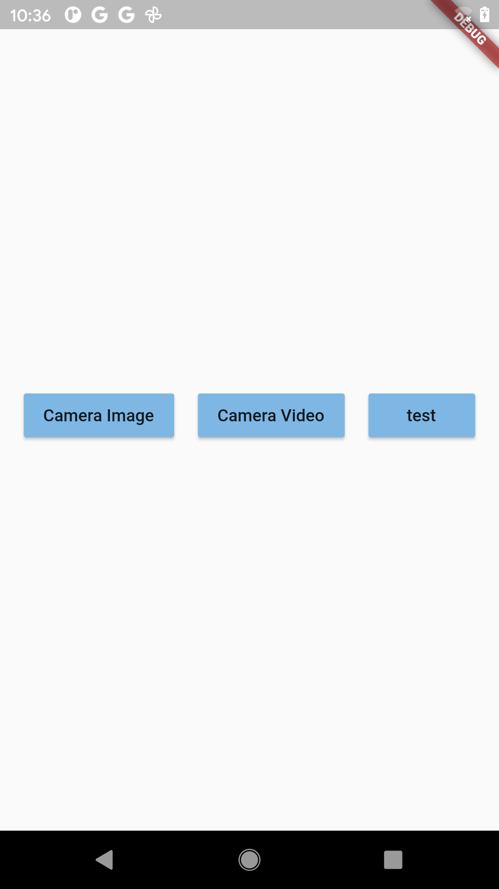
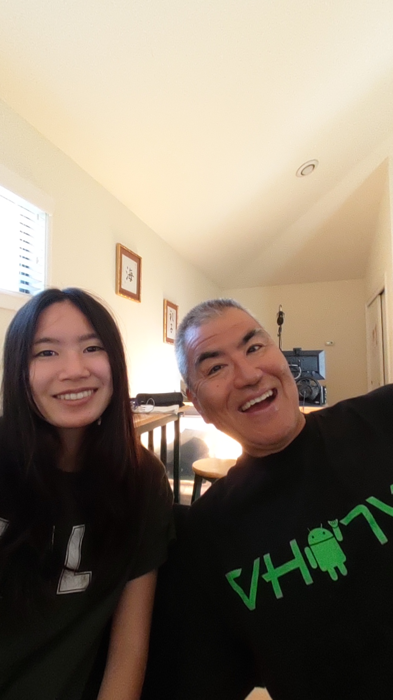

# 9. Saving Image to Device Storage

## Overview

The application saves an image to the device's storage using the [gallery_saver](https://pub.dev/packages/gallery_saver) package for Flutter. The package makes it simple to save images to an Android device.

Below is the directory that the images are saved to on this project: 



This tutorial uses the example by Johannes Milke linked [here](https://www.youtube.com/watch?v=JILcQLZvjKE). 



## Implementation

### Network Image

First, add the `gallery_saver` package to the project. Save an image url to a `String` variable and get a temporary directory. Pass in the image url to the temporary directory using the [dio](https://pub.dev/packages/dio) package. The `GallerySaver` accepts this temporary file and saves it to the device's storage.  

```dart
   String url = 'https://picsum.photos/200/300?grayscale';
              final tempDir = await getTemporaryDirectory();
              print(tempDir);
              final path = '${tempDir.path}/myfile.jpg';
              await Dio().download(url, path);
              await GallerySaver.saveImage(path);
```



### THETA Image

To get the THETA image file, run the [listFiles](https://api.ricoh/docs/theta-web-api-v2.1/commands/camera.list_files/) command from the THETA API. Setting the `startPosition` to 0 and the `entryCount` to 1 will get the last image taken. 

```dart
  var url = Uri.parse('http://192.168.1.1/osc/commands/execute');
              var header = {'Content-Type': 'application/json;charset=utf-8'};
              var bodyMap = {
                'name': 'camera.listFiles',
                'parameters': {
                  'fileType': 'image',
                  'startPosition': 0,
                  'entryCount': 1,
                  'maxThumbSize': 0,
                  '_detail': true,
                }
              };
```

Use the `http` package for Flutter to execute the command and save the response to a variable. 

```dart
              var response =
                  await http.post(url, headers: header, body: bodyJson);
```

Then, parse out the file url from the response.

```dart
              var fileUrl =
                  jsonDecode(response.body)['results']['entries'][0]['fileUrl'];
```

Once the THETA file url is parsed out, the technique between saving the network image and THETA image is the same. 

